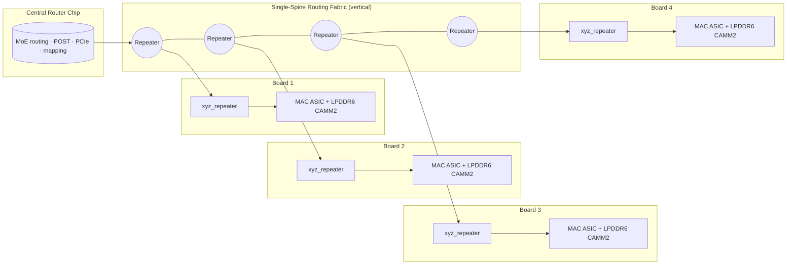
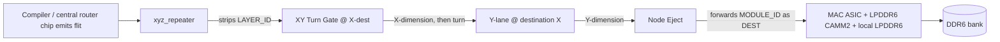
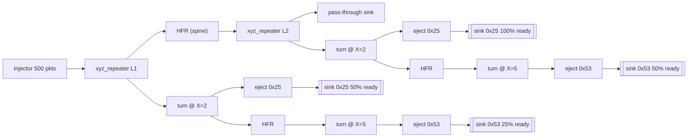
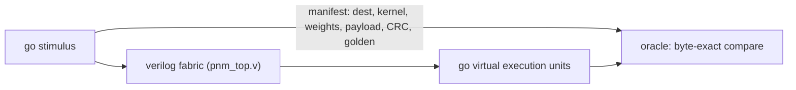

# Bypassing the HBM Wall

> A distributed spatial Processing-Near-Memory (PNM) architecture built from commodity
> 192-bit LPDDR6 CAMM2 modules, mature-node DUV MAC ASICs, and a deterministic single-spine
> wormhole routing fabric.

**Paper:** [*Bypassing the HBM Wall: A Distributed Spatial Processing-Near-Memory Architecture using DUV ASICs and Deterministic Routing*](Paper.MD)

This repository is the working project behind the paper: the manuscript source, the build
pipeline that produces the single DOCX submission, and a **Go ↔ Verilog co-simulation
harness** that pumps real flits through the routing fabric into virtual execution units,
proving the topology delivers packets losslessly under backpressure.

## Why

Modern GPU/HBM monoliths hit a physical and economic wall:

- **HBM** capacity is capped by interposer reticle limits and costs on the order of
  \$375/GB (H100-class).
- **Von Neumann** instruction-fetching spends most of its energy moving data, not computing.

This architecture turns the problem around:

- Replace centralised HBM with **commodity 192-bit LPDDR6 CAMM2** (≈\$16/GB at
  2025–26 DRAM prices, ~24× cheaper than HBM per byte).
- Pair each module with a **mature-node 14/28 nm DUV MAC ASIC** — bandwidth-bound
  workloads never need the EUV cost curve.
- Replace OS/cache scheduling with a **deterministic single-spine wormhole fabric**:
  routing is pure coordinate arithmetic, latency is bounded at compile time, and the
  machine is a physical dataflow graph (no mutable state, no coherency protocols).

The whole system is four kinds of hardware: **DRAM, MACs, repeaters, and one central
router chip** that handles MoE routing, POST discovery, PCIe, and coordinate mapping.
The router chip is a RISC-V BMC/SoC (Linux and Redox compatible) — the only
programmable silicon in the machine. Everything on the data path is pure transport;
everything with state lives in that one chip at the spine root. The SoC (not an MCU)
choice is deliberate: OS compatibility requires NOMMU Linux on an RV32IMAFC core,
PCIe Gen5 endpoint termination needs SoC-class PHY silicon, MoE gating throughput
(10^8–10^9 tokens/s) demands CPU performance beyond MCU envelopes, and routing tables
for 512 nodes exceed MCU SRAM. For source-language transpilation (R, Haskell, HLSL),
the main thread runs on the router chip's CPU — the host ships IR over PCIe and never
touches the spine directly.

A 512-node reference chassis delivers **64 TB** attached memory at **131 TB/s** aggregate
node-local bandwidth (**≈197 TFLOPS FP64**), targeting capacity-bound workloads: MoE
transformer inference, FP64 stencil computation for scientific HPC (climate modeling,
CFD, seismic imaging), and large-scale numerical simulation.

## Architecture

### System topology

Boards are thin X/Y grids stacked vertically; a single spine runs through the stack,
each board hangs off the spine through an `xyz_repeater`, and a central router chip at
the spine root owns MoE routing, POST, PCIe, and mapping.



### Routing: source-routed wormhole with dimension-order turns

A flit is routed by its header only; each hierarchical gate consumes one header byte,
so routing is an `O(1)` coordinate function of `[Layer ID | Module ID]`.



Flit wire format (byte-wide links, CRC-protected destination):

| Byte | Field | Role |
|------|-------|------|
| 0 | `LAYER_ID` | stripped by `xyz_repeater` |
| 1 | `MODULE_ID` = `{X[3:0], Y[3:0]}` | forwarded to DMA as the CRC-protected DEST |
| 2 | `CTRL` = `{vc_class, op, rsvd}` | VC class for deadlock freedom |
| 3–4 | `LEN_LO/HI` | payload length |
| 5… | payload | streamed bytes |
| last 2 | CRC-16 | checked at destination doorbell |

The CRC-16 (CCITT-FALSE, init `0xFFFF`, poly `0x1021`) covers `[MODULE_ID, CTRL,
LEN_LO, LEN_HI, payload]` — everything except `LAYER_ID` (consumed at the repeater)
and the two trailing CRC bytes.

### Verilog fabric sketch (the HDL/ directory)

The HDL is a byte-wide, Verilog-2005 model of the routing fabric: stateless Hardware
Flit Repeaters (HFRs), the `xyz_repeater` layer gate, X→Y dimension-order turn gates,
and node eject gates. Each node's PE tile instantiates a compute unit (BF16/FP16/FP32/FP64
FMA, FP32 ALU, INT8 MAC, or systolic MAC array) selected by the model compiler. The
`HDL/` testbenches exercise a hand-wired 2-board slice; the `sim/` harness *generates*
the full paper topology at any scale (default 3×4×4 = 48 nodes, up to the 8×8×8 = 512-node
reference chassis) from the same gates. It is what the *"lossless under backpressure"* claim
is checked against.



## Repository layout

| Path | Contents |
|------|----------|
| `Paper.MD` | Manuscript source (master copy, Markdown) |
| `TLDR.md` | Quick overview: problem, solution, key numbers, how it works |
| `docs.md` | Comprehensive documentation: HDL, co-sim harness, compiler, wire format, build commands |
| `build.py` | Build pipeline → single submission DOCX |
| `HDL/` | Verilog fabric: HFR, `xyz_repeater`, XY turn, eject, CRC-16 + doorbell DMA + compute units (FP16/BF16/FP32/FP64 FMA, FP32 ALU, INT8 MAC, systolic arrays) + RISC-V BMC/Router SoC (`rv32_core.v`, `uart.v`, `clint.v`, `bmc_router_top.v`) + testbenches |
| `sim/` | Co-simulation harness: topology/tb generators, virtual execution units, model compiler, inference client |
| `sim/internal/pnm/safetensors.go` | Safetensors index parser + model config reader + tensor shape inference |
| `sim/internal/pnm/model_compiler.go` | Model-to-PNM compiler: 5-stage AOT pipeline (ingest → partition → map → route → emit) |
| `sim/fw/` | C firmware port for MCU targets (ARM Cortex-M/R, RISC-V) |
| `sim/examples/gemma4_test/` | Synthetic Gemma-4-26B-A4B-it config + index for testing the compiler |
| `sim/examples/mini_glm_moe/` | Mini GLM-MoE config for testing MoE gating |
| `submission/` | Generated build artifacts (**gitignored**) |
| `shell.nix` | Reproducible build + simulation environment |

## Getting started

Requires [Nix](https://nixos.org) with flakes-style `nix-shell` support.

### 1. Enter the environment

```bash
nix-shell
```

This provides `pdflatex`, `pandoc`, `pdfinfo`, `iverilog`/`vvp`, `verilator`, `go`, and
`python3` (the latter only for the gitignored `build.py` pipeline; the co-simulation
harness is Go standard-library only).

### 2. Build the paper (single DOCX)

```bash
python3 build.py
```

Produces a single submission artifact:

```
submission/paper.docx   # ← the one file you submit
submission/paper.pdf    # reference copy
submission/paper.tex    # generated LaTeX source
```

The pipeline reads `Paper.MD`, converts `{c(n)}` placeholders to `\cite{}`, wraps the
body in a standard `article` class, compiles with `pdflatex`, and converts to DOCX via
`pandoc`.

### 3. Prove the fabric doesn't drop packets

```bash
cd HDL

# functional smoke test
iverilog -g2005 -o tb_fabric.out \
  hfr.v flit_gate.v vc_merge.v xyz_repeater.v xy_turn.v node_eject.v tb_fabric.v && vvp tb_fabric.out

# 500-packet load test with 100/50/25% sink backpressure + checksums
iverilog -g2005 -o tb_load.out \
  hfr.v flit_gate.v vc_merge.v xyz_repeater.v xy_turn.v node_eject.v tb_load.v && vvp tb_load.out

# doorbell DMA: end-to-end CRC-16 + hardened fire conditions (tb_doorbell.v)
iverilog -g2005 -o tb_doorbell.out \
  tb_doorbell.v pe_tile_stub.v doorbell.v crc16.v bf16_fma.v && vvp tb_doorbell.out

# FP32 ALU (divider + multiplier + special cases)
iverilog -g2005 -o tb_fp32_alu.out \
  fp32_alu.v fp32_fma.v tb_fp32_alu.v && vvp tb_fp32_alu.out

# FP16/BF16/FP32/FP64 FMA units (3-cycle pipelined multiply-accumulate)
iverilog -g2005 -o tb_fp16_fma.out fp16_fma.v tb_fp16_fma.v && vvp tb_fp16_fma.out
iverilog -g2005 -o tb_bf16_fma.out bf16_fma.v tb_bf16_fma.v && vvp tb_bf16_fma.out
iverilog -g2005 -o tb_fp32_fma.out fp32_fma.v tb_fp32_fma.v && vvp tb_fp32_fma.out
iverilog -g2005 -o tb_fp64_fma.out fp64_fma.v tb_fp64_fma.v && vvp tb_fp64_fma.out

# INT8 MAC unit
iverilog -g2005 -o tb_int8_mac.out int8_mac.v tb_int8_mac.v && vvp tb_int8_mac.out

# RISC-V BMC/Router SoC (RV32IMA core + UART + CLINT + PNM router engine)
iverilog -g2005 -o tb_bmc_router.out \
  rv32_core.v uart.v clint.v bmc_router_top.v tb_bmc_router.v && vvp tb_bmc_router.out
```

The load test scoreboards every packet end-to-end: destination packet counts, SOP/EOP
integrity, payload checksums, and misroute guards on the X-lane (must be zero). Expect
`*** LOAD TEST PASSED (500 packets) ***`. The doorbell test drives eight packets
through a `pe_tile_stub` (AXI-Stream, `MULT_LATENCY=2`) and checks that
`DOORBELL_TRIG`/`DOORBELL_ACK` fire together only on valid messages and `NODE_ERR`
alone otherwise: 6 activations (p0–p3, p6, p7), 2 rejections (truncated message,
wrong DEST), and 2 `corrupt_out` pulses (p2, p3 — stub-detected incoming-CRC
failures, the hardware doorbell verdict the co-sim accounts for).

### 4. Co-simulation: virtual execution units over the real fabric

```bash
cd sim
go run ./cmd/pnm                 # 3x4x4 = 48 nodes, all scenarios, parallel slices
go run ./cmd/pnm -l 8 -x 8 -y 8  # the 512-node reference chassis
go run ./cmd/pnm --groups 1      # force a single monolithic vvp process
go run ./cmd/pnmc examples/bias_add.pnm -l 8 -x 8 -y 8   # compile + run a program
```

No external Go modules; `go test ./internal/pnm/` pins the RNG to CPython output.

The pipeline mirrors the paper's dataflow (Paper.MD §2.1–2.2 routing, §2.9
doorbell activation):



1. `internal/pnm/gen_topology.go` wires the paper topology from the `HDL/` gates
   (`xyz_repeater` spine + HFR repeaters → `xy_turn` X-lanes → `node_eject` Y-lanes).
2. The harness writes the injection program, the Go-side manifest — every
   flit, its destination (`MODULE_ID` forwarded by eject as the DEST byte), the
   node's resident kernel + weights, payload, a real CRC-16 (CCITT-FALSE over
   `[MODULE_ID, CTRL, LEN_LO, LEN_HI, payload]`), and golden results — plus a
   per-node backpressure schedule.
3. The chassis is partitioned into contiguous layer slices (default one per
   CPU core; spine stages upstream of a destination layer are transparent
   pass-through, so slicing is byte-exact vs. the monolith). Each slice gets
   its own topology, stimulus, and `gen_tb.go` harness, and its own `vvp`
   process — all run in parallel. The harness streams at up to 1 byte/cycle
   (§2.8: one routing decision per clock) and logs every delivered byte,
   cycle-stamped.
4. Go runs each node's **doorbell discipline** (§2.9): the resident
   kernel fires only when all three conditions hold — the landed byte count
   equals `LEN+6`, the end-to-end CRC validates, and the DEST byte equals the
   node's own coordinate; refusals are logged (`NODE_ERR`) and never fire the
   kernel. Kernels (`echo`, `sum`, `accum`, and `dot` — a MAC-array dot
   product against resident weights, §2.9 COMPUTE) execute on what the
   hardware actually delivered and are checked against the golden manifest.
   The same three-condition fire logic is implemented in hardware as
   `HDL/doorbell.v` (with `crc16.v`), exercised by `HDL/tb_doorbell.v`.

Scenarios:

| Scenario | What it proves |
|----------|----------------|
| `sweep`  | one flit to every node; per-node kernels; idle fabric ⇒ per-packet latency **exactly** equals the closed form (wire stages + spine hops + X hops), §2.5/§3.4 |
| `load`   | 500 flits, random destinations/kernels, slow-DMA sinks, pass-through tail — zero drops, zero misroutes |
| `hotspot`| MoE hot expert (§2.12): ~35% of traffic as kilobyte-class tokens to the worst-case corner node behind a 1-in-8 DMA |
| `stress` | ~24 flits/node, 4 B–1 KB payloads, ~3% corrupt-CRC messages the doorbell **must reject** (§2.9), ~5% pass-through |
| `replay` | stress run twice; delivery logs must be **bit-identical** (§2.10/§4.3 deterministic replay) |

Expect `ALL SCENARIOS PASSED`. A 512-node run prints per-slice spans and
per-packet latency min/mean/max for each scenario.

### 5. Static lint (optional)

```bash
verilator --lint-only -Wno-MULTITOP \
  hfr.v flit_gate.v xyz_repeater.v xy_turn.v node_eject.v
```

### 6. Model compiler: safetensors → PNM

### 5b. Workload simulations: canonical HPC algorithms

Five built-in workloads exercise distinct routing patterns against the
co-simulation harness — each maps a well-known algorithm class onto the fabric
and verifies byte-exact delivery:

```bash
cd sim

# 5-point Jacobi stencil: intra-layer X→Y dimension-order routing only
go run ./cmd/pnmc workload jacobi5 -l 1 -x 4 -y 4 -run

# Matrix-vector product (weight-stationary): spine descent for cross-layer rows
go run ./cmd/pnmc workload matvec -l 4 -x 4 -y 4 -frag 16 -run

# Reverse-path merge tree: leaves → root through the arbitrated egress path
go run ./cmd/pnmc workload reduction -l 4 -x 4 -y 4 -frag 32 -run

# Weight distribution broadcast: spine descent + per-layer X→Y fan-out
go run ./cmd/pnmc workload broadcast -l 4 -x 4 -y 4 -frag 64 -run

# All-pairs O(N²) saturation benchmark (capped at 64 nodes)
go run ./cmd/pnmc workload nbody -l 4 -x 2 -y 2 -frag 8 -run
```

Each workload emits a `.pnm` program and optionally runs it against the gate-level
fabric. The `-o` flag redirects output; without `-run` the program is emitted only.

| Workload | Routing pattern | Use case |
|----------|----------------|----------|
| `jacobi5` | Intra-layer X→Y dimension-order | Stencil / halo exchange |
| `matvec` | Spine descent + intra-layer | Weight-stationary linear algebra |
| `reduction` | Reverse-path merge (egress→Y→X→spine) | Reduction trees, aggregation |
| `broadcast` | Spine descent + per-layer fan-out | Weight upload, distribution |
| `nbody` | All paths saturated (worst case) | Upper-bound benchmark |

The model compiler transpiles a HuggingFace model (safetensors + config.json) onto
a PNM chassis. It parses the safetensors index, computes tensor sizes from shapes,
partitions model layers across physical layers, distributes experts across nodes,
and emits a `.pnm` program + chassis schema.

```bash
cd sim

# compile a model onto a 4-layer, 4x4 chassis (64 nodes)
go run ./cmd/pnmc compile-model examples/gemma4_test -l 4 -x 4 -y 4

# compile onto the 8-layer reference chassis (512 nodes)
go run ./cmd/pnmc compile-model examples/gemma4_test -l 8 -x 8 -y 8
```

The compiler outputs:
- **Compilation listing** — per-node tensor assignments, memory usage, utilization
- **Schema** (`gemma4_schema.txt`) — coordinate map, MODULE_ID, routing bitmaps, spine sizing
- **Program** (`gemma4.pnm`) — kernel/bias/token directives for the co-simulation

For a real model (e.g., `google/gemma-4-26B-A4B-it`), point the compiler at a
directory containing `config.json` and `model.safetensors.index.json`:

```bash
# download config + index only (not the full 51 GB of weights)
mkdir /tmp/gemma4 && cd /tmp/gemma4
wget https://huggingface.co/google/gemma-4-26B-A4B-it/resolve/main/config.json
wget https://huggingface.co/google/gemma-4-26B-A4B-it/resolve/main/model.safetensors.index.json

# compile onto 64 nodes
go run ./cmd/pnmc compile-model /tmp/gemma4 -l 4 -x 4 -y 4
```

The compiler is model-agnostic: it reads any safetensors index + config.json
combination and maps it onto any chassis dimensions. The `.pnm` output is
compatible with the existing co-simulation pipeline (step 4).

### 7. C firmware for MCU targets

The firmware from `sim/internal/pnm/firmware.go` has been ported to C for
bare-metal microcontroller targets (ARM Cortex-M/R, RISC-V, custom MCU).
Static allocation only — no `malloc`, no dynamic memory.

```bash
cd sim/fw

# compile check (should produce zero warnings)
gcc -Wall -Wextra -std=c11 -c pnm_fw.c -o pnm_fw.o

# full build with linking
gcc -Wall -Wextra -std=c11 pnm_fw.c -o pnm_fw
```

The C port implements the same boot sequence (POST discovery, routing table
load, weight upload, MoE gating load) and runtime dispatch loop (30 dense +
240 MoE dispatches per token for Gemma-4) as the Go firmware, plus full
KV cache management with LRU eviction.

### 8. Inference client

For FP16/BF16 models, the co-simulation harness includes an inference client
that handles tokenization, prefill, autoregressive generation, and
temperature/nucleus sampling. The client supports both transformer inference
and serves as a driver for MoE dispatch verification.

```bash
cd sim
go test ./internal/pnm/ -run TestLLMClient -v  # demo: encode, generate 10 tokens, print stats
```

The client tracks per-inference statistics (tokens generated, dispatches,
KV store operations) and reports compute unit utilization across the chassis.

## Verification claims

- **Lossless under backpressure** — demonstrated by `tb_load.v` (500 packets, sinks at
  100/50/25% readiness, end-to-end checksums match) and by the `sim/` co-simulation at
  full chassis scale (every node's DMA sink backpressured up to 1-in-8, kilobyte-class
  tokens, byte-exact delivery, resident kernels execute on the delivered payloads).
- **No misroutes** — X-lane and Y-lane residuals must be 0; dimension-order X→Y turns
  leave no residual traffic.
- **Deterministic routing** — every gate is a pure function of header bytes; no runtime
  state, no arbitration ambiguity, latency bounded at compile time (paper §4.3). The
  `sweep` scenario checks every packet's measured latency **equals** the closed form
  (pipe stages + spine hops + X hops, §2.5/§3.4) exactly.
- **The doorbell never fires on corrupt messages** (§2.9) — `stress` injects ~3%
  messages with a deliberately broken CRC; delivery still happens (the fabric is pure
  transport), but every one is rejected at the destination DMA and its kernel never runs.
  The same three-condition fire logic (`LEN+6` bytes, CRC valid, DEST == own coordinate)
  is proven in RTL by `HDL/tb_doorbell.v`, which also checks that `DOORBELL_ACK` never
  asserts without `DOORBELL_TRIG` and that a rejected frame never re-fires.
- **Bit-exact replay** (§2.10/§4.3) — `replay` runs an identical stress load twice;
  the cycle-stamped delivery logs must be bit-identical.

## The paper

The full architectural specification — node hardware (§3), routing fabric (§4), compiler
stack (§5), results and roofline analysis (§9), economics (§12) — lives in
[`Paper.MD`](Paper.MD). The one-file submission DOCX is built by `build.py` as described
above.

## License

Three-way split, detailed in [LICENSE](LICENSE): the manuscript and paper artifacts
(`Paper.MD`, `submission/*`) are [CC BY-SA 4.0](https://creativecommons.org/licenses/by-sa/4.0/);
the HDL under [`HDL/`](HDL/) is [CERN-OHL-S v2](LICENSE); build and simulation code plus
this README are [AGPL-3.0-or-later](LICENSE).
