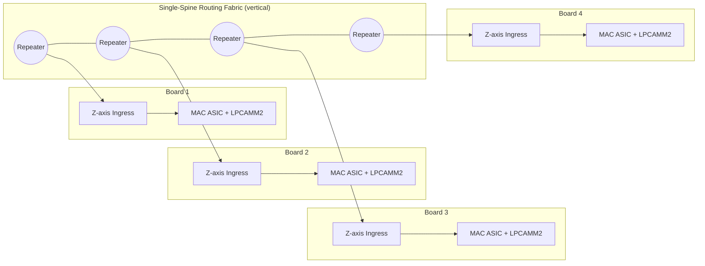
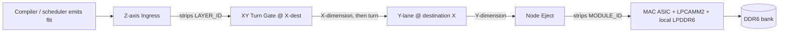
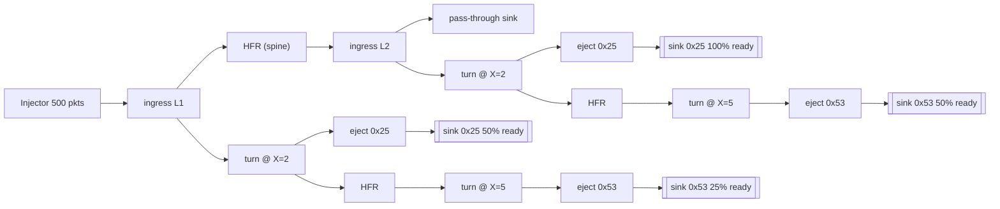
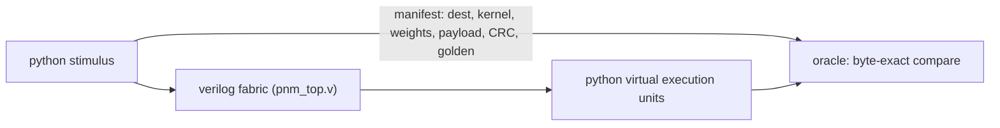

# Bypassing the HBM Wall

> A distributed spatial Processing-Near-Memory (PNM) architecture built from commodity
> LPCAMM2 LPDDR6 modules, mature-node DUV MAC ASICs, and a deterministic single-spine
> wormhole routing fabric.

**Paper:** [*Bypassing the HBM Wall: A Distributed Spatial Processing-Near-Memory Architecture using DUV ASICs and Deterministic Routing*](Paper.MD)

This repository is the working project behind the paper: the manuscript source, the build
pipeline that produces the single DOCX submission, and a **Python ↔ Verilog co-simulation
harness** that pumps real flits through the routing fabric into virtual execution units,
proving the topology delivers packets losslessly under backpressure.

## Why

Modern GPU/HBM monoliths hit a physical and economic wall:

- **HBM** capacity is capped by interposer reticle limits and costs on the order of
  \$375/GB (H100-class).
- **Von Neumann** instruction-fetching spends most of its energy moving data, not computing.

This architecture turns the problem around:

- Replace centralised HBM with **commodity LPCAMM2 LPDDR6** (≈\$4/GB).
- Pair each module with a **mature-node 14/28 nm DUV MAC ASIC** — bandwidth-bound
  workloads never need the EUV cost curve.
- Replace OS/cache scheduling with a **deterministic single-spine wormhole fabric**:
  routing is pure coordinate arithmetic, latency is bounded at compile time, and the
  machine is a physical dataflow graph (no mutable state, no coherency protocols).

A 512-node reference chassis delivers **64 TB** attached memory at **87 TB/s** aggregate
local bandwidth.

## Architecture

### System topology

Boards are thin X/Y grids stacked vertically; a single spine runs through the stack and
each board hangs off the spine through a Z-axis ingress node.



### Routing: source-routed wormhole with dimension-order turns

A flit is routed by its header only; each hierarchical gate consumes one header byte,
so routing is an `O(1)` coordinate function of `[Layer ID | Module ID]`.



Flit wire format (byte-wide links):

| Byte | Field | Role |
|------|-------|------|
| 0 | `LAYER_ID` | stripped by Z-axis ingress |
| 1 | `MODULE_ID` = `{X[3:0], Y[3:0]}` | stripped by node eject |
| 2 | `CTRL` = `{vc_class, op, rsvd}` | VC class for deadlock freedom |
| 3–4 | `LEN_LO/HI` | payload length |
| 5… | payload | streamed bytes |
| last 2 | CRC-16 | checked at destination DMA |

### Verilog fabric sketch (the HDL/ directory)

The HDL is a byte-wide, Verilog-2005 model of the routing fabric: stateless Hardware
Flit Repeaters (HFRs), the Z-axis ingress gate, X→Y dimension-order turn gates, and node
eject gates. The `HDL/` testbenches exercise a hand-wired 2-board slice; the `sim/`
harness *generates* the full paper topology at any scale (default 3×4×4 = 48 nodes, up to
the 8×8×8 = 512-node reference chassis) from the same gates. It is what the *"lossless
under backpressure"* claim is checked against.



## Repository layout

| Path | Contents |
|------|----------|
| `Paper.MD` | Manuscript source (master copy, Markdown) |
| `build.py` | Build pipeline → single submission DOCX |
| `HDL/` | Verilog fabric: HFR, ingress, XY turn, eject + testbenches |
| `sim/` | Co-simulation harness: topology/tb generators, virtual execution units |
| `submission/` | Generated build artifacts (**gitignored**) |
| `shell.nix` | Reproducible build + simulation environment |

## Getting started

Requires [Nix](https://nixos.org) with flakes-style `nix-shell` support.

### 1. Enter the environment

```bash
nix-shell
```

This provides `pdflatex`, `pandoc`, `pdfinfo`, `iverilog`/`vvp`, `verilator`, and
`python3` (the co-simulation harness is standard-library only).

### 2. Build the paper (single DOCX)

```bash
python3 build.py
```

Produces a single submission artifact:

```
submission/paper.docx   # ← the one file you submit
submission/paper.pdf    # reference copy
submission/paper.tex    # generated LaTeX source
```

The pipeline reads `Paper.MD`, converts `{c(n)}` placeholders to `\cite{}`, wraps the
body in a standard `article` class, compiles with `pdflatex`, and converts to DOCX via
`pandoc`.

### 3. Prove the fabric doesn't drop packets

```bash
cd HDL

# functional smoke test
iverilog -g2005 -o tb_fabric.out \
  hfr.v flit_gate.v z_ingress.v xy_turn.v node_eject.v tb_fabric.v && vvp tb_fabric.out

# 500-packet load test with 100/50/25% sink backpressure + checksums
iverilog -g2005 -o tb_load.out \
  hfr.v flit_gate.v z_ingress.v xy_turn.v node_eject.v tb_load.v && vvp tb_load.out
```

The load test scoreboards every packet end-to-end: destination packet counts, SOP/EOP
integrity, payload checksums, and misroute guards on the X-lane (must be zero). Expect
`*** LOAD TEST PASSED (500 packets) ***`.

### 4. Co-simulation: virtual execution units over the real fabric

```bash
cd sim
python3 run.py                 # 3x4x4 = 48 nodes, all scenarios, parallel slices
python3 run.py -l 8 -x 8 -y 8  # the 512-node reference chassis
python3 run.py --groups 1      # force a single monolithic vvp process
```

The pipeline mirrors the paper's dataflow (Paper.MD §2.1–2.2 routing, §2.9
doorbell activation):



1. `gen_topology.py` wires the paper topology from the `HDL/` gates
   (`z_ingress` spine + HFR repeaters → `xy_turn` X-lanes → `node_eject` Y-lanes).
2. `run.py` writes the injection program, the Python-side manifest — every
   flit, its destination, the node's resident kernel + weights, payload, a
   real CRC-16, and golden results — plus a per-node backpressure schedule.
3. The chassis is partitioned into contiguous layer slices (default one per
   CPU core; spine stages upstream of a destination layer are transparent
   pass-through, so slicing is byte-exact vs. the monolith). Each slice gets
   its own topology, stimulus, and `gen_tb.py` harness, and its own `vvp`
   process — all run in parallel. The harness streams at up to 1 byte/cycle
   (§2.8: one routing decision per clock) and logs every delivered byte,
   cycle-stamped.
4. Python runs each node's **doorbell discipline** (§2.9): the resident
   kernel fires only when the landed byte count equals the length field and
   the end-to-end CRC validates. Kernels (`echo`, `sum`, `accum`, and `dot`
   — a MAC-array dot product against resident weights, §2.9 COMPUTE) execute
   on what the hardware actually delivered and are checked against the
   golden manifest.

Scenarios:

| Scenario | What it proves |
|----------|----------------|
| `sweep`  | one flit to every node; per-node kernels; idle fabric ⇒ per-packet latency **exactly** equals the closed form (wire stages + spine hops + X hops), §2.5/§3.4 |
| `load`   | 500 flits, random destinations/kernels, slow-DMA sinks, pass-through tail — zero drops, zero misroutes |
| `hotspot`| MoE hot expert (§2.12): ~35% of traffic as kilobyte-class tokens to the worst-case corner node behind a 1-in-8 DMA |
| `stress` | ~24 flits/node, 4 B–1 KB payloads, ~3% corrupt-CRC messages the doorbell **must reject** (§2.9), ~5% pass-through |
| `replay` | stress run twice; delivery logs must be **bit-identical** (§2.10/§4.3 deterministic replay) |

Expect `ALL SCENARIOS PASSED`. A 512-node run prints per-slice spans and
per-packet latency min/mean/max for each scenario.

### 5. Static lint (optional)

```bash
verilator --lint-only -Wno-MULTITOP \
  hfr.v flit_gate.v z_ingress.v xy_turn.v node_eject.v
```

## Verification claims

- **Lossless under backpressure** — demonstrated by `tb_load.v` (500 packets, sinks at
  100/50/25% readiness, end-to-end checksums match) and by the `sim/` co-simulation at
  full chassis scale (every node's DMA sink backpressured up to 1-in-8, kilobyte-class
  tokens, byte-exact delivery, resident kernels execute on the delivered payloads).
- **No misroutes** — X-lane and Y-lane residuals must be 0; dimension-order X→Y turns
  leave no residual traffic.
- **Deterministic routing** — every gate is a pure function of header bytes; no runtime
  state, no arbitration ambiguity, latency bounded at compile time (paper §4.3). The
  `sweep` scenario checks every packet's measured latency **equals** the closed form
  (pipe stages + spine hops + X hops, §2.5/§3.4) exactly.
- **The doorbell never fires on corrupt messages** (§2.9) — `stress` injects ~3%
  messages with a deliberately broken CRC; delivery still happens (the fabric is pure
  transport), but every one is rejected at the destination DMA and its kernel never runs.
- **Bit-exact replay** (§2.10/§4.3) — `replay` runs an identical stress load twice;
  the cycle-stamped delivery logs must be bit-identical.

## The paper

The full architectural specification — node hardware (§3), routing fabric (§4), compiler
stack (§5), results and roofline analysis (§9), economics (§12) — lives in
[`Paper.MD`](Paper.MD). The one-file submission DOCX is built by `build.py` as described
above.

## License

HDL and build code: [CERN-OHL-S](LICENSE). Manuscript text © Bowen Gu; see
`Paper.MD` header.
